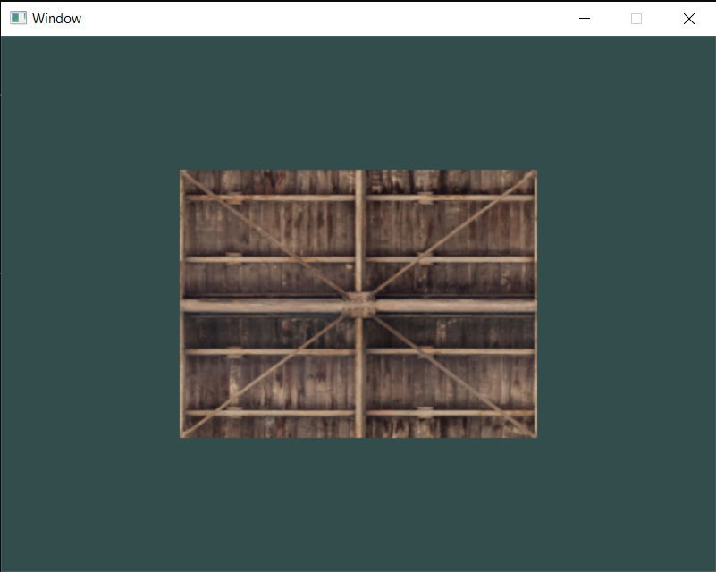

# SDL2 OpenGL Starter

A simple SDL2 OpenGL template that automatically installs SDL2 and GLEW as well as [stb_image.h](https://github.com/nothings/stb) and [glm](https://github.com/g-truc/glm) using CMake.



## Build

### Windows

```bash
mkdir build
cd build
cmake ..
cmake --build .
```

### Linux

````bash

```bash
sudo apt install libsdl2-dev libsdl2-image-dev libglew-dev libgle3-dev

mkdir build
cd build
cmake ..
cmake --build .
````

```

```
